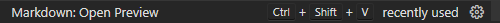

# MarkDown-Apuntes

# Introducción

[Markdow](https://es.wikipedia.org/wiki/Markdown) es un lenguaje de marcado ligero. Trata de conseguir la máxima legibilidad y facilidad. Algunos editores de Markdown puede ser [MarkText](https://marktext.app/) o incluso algunas aplicaciones web como [Notion](https://www.notion.so/es-es) pasan el contenido a Markdown. 

- Guía Completa:
    - [https://www.markdownguide.org/cheat-sheet/](https://www.markdownguide.org/cheat-sheet/)
    - [https://github.com/adam-p/markdown-here/wiki/Markdown-Cheatsheet](https://github.com/adam-p/markdown-here/wiki/Markdown-Cheatsheet)

Para ver el previsualizador en VS se presiona la tecla f1 y se escribe “Markdown: Open Preview”. Otra forma es puntando Ctrl+Shift+V



# Sintaxis Básica

## Heading

```markdown
# Titulo h1
## Titulo h2
### Titulo h3
#### Titulo h4
##### Titulo h5
###### Titulo h6
```

## Text

### Texto

```markdown
Italic text se usa * por ejemplo *Hola*

Strong text se usa ** por ejemplo **Hola**

Tachado se usa ~~ por ejemplo ~~Hola~~
```

### Listas

```markdown
<!-- UL -->
* UL 1
    * UL 1.1
* UL 2
    * UL 2.2
* UL 3

<!-- OL -->
1. OL 1
    1. OL 1.1
2. OL 2
3. OL 3
```

### Enlaces

```markdown
[youtube.com](https://www.youtube.com/)

[youtube.com](https://www.youtube.com/ "Titulo cuando se pasa el cursor por encima")
```

### Citas

```markdown
> Se utiliza  >
```

### Separadores

```markdown
---
Se utiliza --
---
```

## Escribir Código

```markdown
<!-- Codigo UNA linea -->
`
Console.log('HELLO WORLD');
`

<!-- Codigo Multiples Lineas -->
<!-- Se especifica el codigo para que se pinte -->
```javascript
Console.log('HELLO WORLD')

Console.log('HELLO WORLD')

Console.log('HELLO WORLD')

let x = 1;

```
```

## Tablas

```markdown
<!-- Tablas-->
| Primera columna | Segunda columna | Tercera columna |
| -- | -- | -- |
```

## Imágenes

```markdown
<!-- Imagenes URL -->


<!-- Imagenes LOCALES -->

```  

# Github Markdown

Más información: [https://docs.github.com/es/get-started/writing-on-github/getting-started-with-writing-and-formatting-on-github/about-writing-and-formatting-on-github](https://docs.github.com/es/get-started/writing-on-github/getting-started-with-writing-and-formatting-on-github/about-writing-and-formatting-on-github)

Github tiene sus propias reglas de Markdown (no estandar) como puede ser los to-do y los [emojis](https://gist.github.com/rxaviers/7360908). También puedes mencionar a otros usuarios,... 

```markdown
<!-- TO DO -->
* [x] Task 1
* [ ] Task 2
* [x] Task 3

<!-- EMOJIS Y MENCIONES -->
<!-- Recibira una notificacion -->
@AlvaroCodes

:blush: Emojis: https://gist.github.com/rxaviers/7360908
```